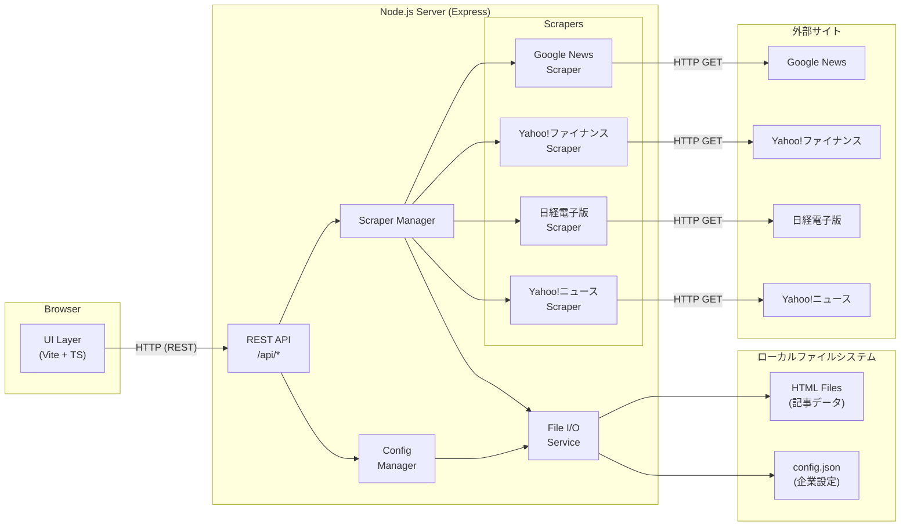
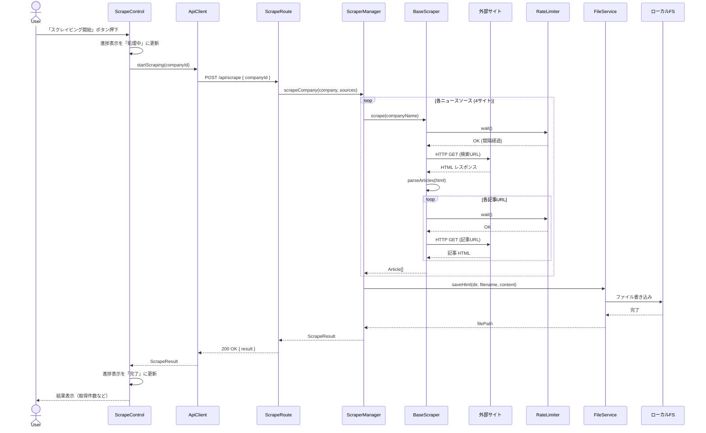
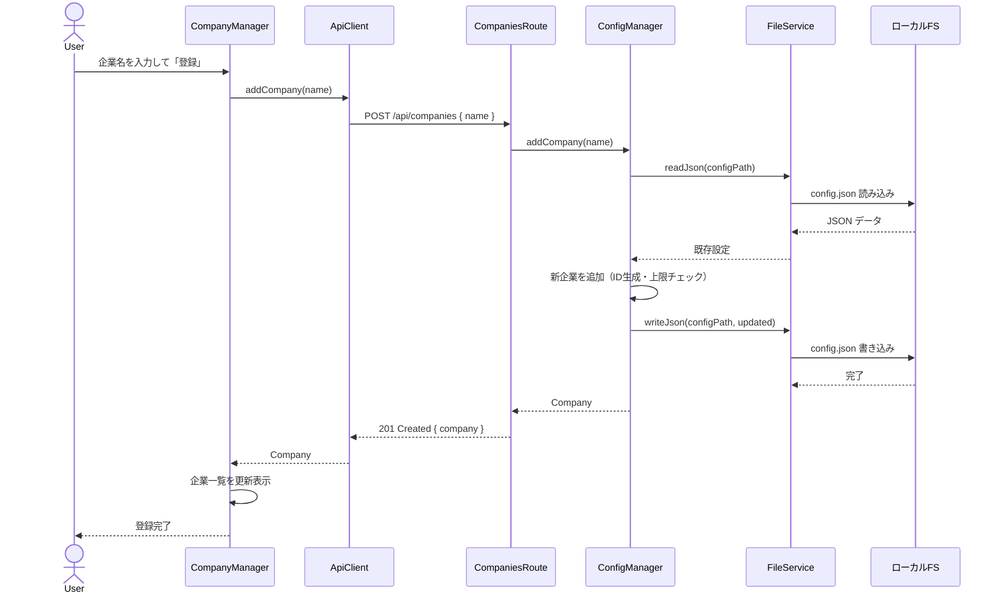
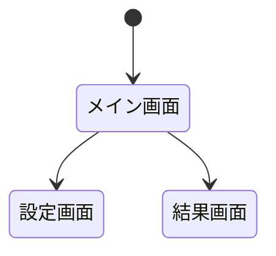

# SPEC: WEBスクレイピングツール

> **SPEC駆動開発 (SDD)** — 本ドキュメントが唯一の信頼できる仕様源です。
> 実装は必ず本SPECに準拠し、変更がある場合はSPECを先に更新してください。

---

## 1. 概要 (Overview)

### 1.1 プロジェクト概要

| 項目           | 内容                                                           |
| -------------- | -------------------------------------------------------------- |
| プロジェクト名 | Stock News Scraper                                             |
| 概要           | 企業ニュースを収集し、株価傾向分析の入力データを生成するツール |
| バージョン     | 0.1.0                                                          |
| 最終更新日     | 2026-02-28                                                     |
| ステータス     | Draft                                                          |

### 1.2 目的・背景

株価の変動要因を分析するために、過去の株価に連動したと思われるニュース記事を収集・蓄積する必要がある。本ツールは、ユーザが指定した企業に関するニュース記事をWebからスクレイピングし、株価傾向分析ツールへのインプットデータとして提供することを目的とする。

- **対象ユーザ:** 個人利用（自分専用）
- **ユースケース:** ユーザが企業名を設定 → ニュース記事を収集 → HTML形式で保存 → 株価分析ツールの入力データとして活用

### 1.3 スコープ

<!-- 本プロジェクトで対応する範囲と対応しない範囲を明確にする -->

**対応する範囲 (In Scope):**

- ユーザが企業名（銘柄）を設定・管理する機能
- 設定された企業に関するニュース記事のスクレイピング
- スクレイピング結果をHTMLファイル（記事そのもの）として保存・出力
- ユーザ操作をトリガーとしたスクレイピング実行（手動実行）
- Webアプリとしてのブラウザベースのユーザインターフェース

**対応しない範囲 (Out of Scope):**

- ログイン認証が必要なサイトのスクレイピング
- 株価分析・予測ロジック本体（本ツールはデータ収集のみ）
- 定期自動実行 / スケジューリング（将来対応の可能性あり、現時点では対象外）
- マルチユーザ対応・認証・権限管理
- モバイルアプリ対応

---

## 2. 要件定義 (Requirements)

### 2.1 機能要件 (Functional Requirements)

| ID     | 要件                                                                               | 優先度 | ステータス |
| ------ | ---------------------------------------------------------------------------------- | ------ | ---------- |
| FR-001 | 企業名（銘柄）の登録・編集・削除ができる（最大30社）                               | Must   | TODO       |
| FR-002 | 登録企業一覧を保存ディレクトリ内の設定ファイルに永続化する                         | Must   | TODO       |
| FR-003 | ユーザがボタン操作で選択した企業のニュース記事スクレイピングを実行できる           | Must   | TODO       |
| FR-004 | Google Newsからニュース記事を取得できる                                            | Must   | TODO       |
| FR-005 | Yahoo!ファイナンスからニュース記事を取得できる                                     | Must   | TODO       |
| FR-006 | 日経電子版からニュース記事を取得できる                                             | Must   | TODO       |
| FR-007 | Yahoo!ニュースからニュース記事を取得できる                                         | Must   | TODO       |
| FR-008 | スクレイピング結果をHTMLファイル（記事本文）としてユーザ指定ディレクトリに保存する | Must   | TODO       |
| FR-009 | ユーザが保存先ディレクトリを選択・変更できる                                       | Must   | TODO       |
| FR-010 | 収集済み記事の一覧を日付順で表示できる                                             | Must   | TODO       |
| FR-011 | 全登録企業を対象に一括スクレイピングを実行できる                                   | Should | TODO       |
| FR-012 | スクレイピングの進捗状況をUIに表示する（処理中/完了/エラー）                       | Should | TODO       |
| FR-013 | 重複記事の検出・スキップを行う                                                     | Should | TODO       |

### 2.2 非機能要件 (Non-Functional Requirements)

| ID      | 要件                                                                           | カテゴリ               | ステータス |
| ------- | ------------------------------------------------------------------------------ | ---------------------- | ---------- |
| NFR-001 | 30社分のスクレイピングを妥当な時間内（目安5分以内）に完了する                  | パフォーマンス         | TODO       |
| NFR-002 | スクレイピング対象サイトへ過度なリクエストを送らない（リクエスト間隔を設ける） | 倫理・コンプライアンス | TODO       |
| NFR-003 | 対象サイトのrobots.txtを尊重する                                               | 倫理・コンプライアンス | TODO       |
| NFR-004 | 直感的に操作可能なUI（マニュアル不要で利用できるレベル）                       | ユーザビリティ         | TODO       |
| NFR-005 | 保存先ディレクトリ以外のファイルシステムにアクセスしない                       | セキュリティ           | TODO       |
| NFR-006 | スクレイピング失敗時にアプリがクラッシュしない（エラーをハンドリングし継続）   | 信頼性                 | TODO       |

### 2.3 制約事項

- **技術スタック:** フロントエンド: Vite + TypeScript / バックエンド: Node.js + Express + TypeScript
- **対応ブラウザ:** Chrome 最新版のみ
- **アーキテクチャ:** ブラウザからの直接スクレイピングはCORS制約があるため、Node.jsバックエンドサーバーを経由してスクレイピングを行う
- **スクレイピング対象:** Google News / Yahoo!ファイナンス / 日経電子版 / Yahoo!ニュース（公開ページのみ、ログイン不要のもの）
- **登録企業数上限:** 最大30社
- **データ保存:** ユーザが指定したローカルディレクトリにHTMLファイルとして保存（DB不使用）
- **利用形態:** 個人利用（ローカル環境で起動）

---

## 3. アーキテクチャ設計 (Architecture)

### 3.1 システム構成図



**通信フロー:**

1. ブラウザ (UI) → Express サーバー: REST API 呼び出し (`localhost`)
2. Express サーバー → 外部サイト: HTTP GET でページ取得（CORS 回避）
3. Express サーバー → ローカルFS: 記事 HTML 保存 / 設定ファイル読み書き

### 3.2 技術スタック

| レイヤー       | 技術                           | 備考                                              |
| -------------- | ------------------------------ | ------------------------------------------------- |
| フロントエンド | Vite + TypeScript              | SPA、UIフレームワークなし（Vanilla TS）           |
| バックエンド   | Node.js + Express + TypeScript | REST API サーバー、CORS回避のプロキシ兼務         |
| スクレイピング | axios + cheerio                | HTTP取得 + HTMLパース。JSレンダリング不要の前提   |
| データ保存     | ローカルファイルシステム (fs)  | HTML ファイル + JSON 設定ファイル。DB不使用       |
| 共有型定義     | TypeScript (shared types)      | フロント・バックエンド間で共有する型定義          |
| テスト         | Vitest                         | ユニットテスト。Vite エコシステムとの親和性が高い |
| リンター       | ESLint + Prettier              | コード品質・フォーマット統一                      |

### 3.3 ディレクトリ構成

```
/
├── package.json              # ルート（ワークスペース管理・共通スクリプト）
├── tsconfig.json             # ベース TypeScript 設定
├── SPEC.md
│
├── shared/                   # フロント・バックエンド共有コード
│   └── types/
│       ├── company.ts        # 企業データ型定義
│       ├── article.ts        # 記事データ型定義
│       └── api.ts            # API リクエスト/レスポンス型定義
│
├── client/                   # フロントエンド (Vite + TS)
│   ├── index.html
│   ├── vite.config.ts
│   ├── tsconfig.json
│   └── src/
│       ├── main.ts           # エントリーポイント
│       ├── style.css         # グローバルスタイル
│       ├── components/       # UI コンポーネント
│       │   ├── CompanyManager.ts    # 企業登録・管理 UI
│       │   ├── ScrapeControl.ts     # スクレイピング実行 UI
│       │   └── ArticleList.ts       # 記事一覧表示 UI
│       ├── services/         # API クライアント
│       │   └── apiClient.ts
│       └── utils/
│
└── server/                   # バックエンド (Express + TS)
    ├── tsconfig.json
    └── src/
        ├── index.ts          # サーバーエントリーポイント
        ├── routes/           # API ルート定義
        │   ├── companies.ts  # /api/companies
        │   ├── scrape.ts     # /api/scrape
        │   └── articles.ts   # /api/articles
        ├── scrapers/         # サイト別スクレイパー
        │   ├── BaseScraper.ts
        │   ├── GoogleNewsScraper.ts
        │   ├── YahooFinanceScraper.ts
        │   ├── NikkeiScraper.ts
        │   └── YahooNewsScraper.ts
        ├── services/         # ビジネスロジック
        │   ├── ScraperManager.ts
        │   ├── ConfigManager.ts
        │   └── FileService.ts
        └── utils/
            └── rateLimiter.ts  # リクエスト間隔制御
```

---

## 4. コンポーネント設計 (Component Design)

### 4.1 コンポーネント一覧

**フロントエンド (client)**

| コンポーネント名 | 責務                                             | 依存先    |
| ---------------- | ------------------------------------------------ | --------- |
| CompanyManager   | 企業の登録・編集・削除 UI を提供する             | ApiClient |
| ScrapeControl    | スクレイピング実行ボタン・進捗表示 UI を提供する | ApiClient |
| ArticleList      | 収集済み記事の日付順一覧表示 UI を提供する       | ApiClient |
| ApiClient        | バックエンド REST API への HTTP 通信を抽象化する | fetch API |

**バックエンド (server)**

| コンポーネント名    | 責務                                                       | 依存先                                |
| ------------------- | ---------------------------------------------------------- | ------------------------------------- |
| CompaniesRoute      | /api/companies のルーティングとリクエスト処理              | ConfigManager                         |
| ScrapeRoute         | /api/scrape のルーティングとリクエスト処理                 | ScraperManager                        |
| ArticlesRoute       | /api/articles のルーティングとリクエスト処理               | FileService                           |
| ScraperManager      | スクレイピング全体の制御（対象サイト振り分け・並行制御）   | BaseScraper, FileService, RateLimiter |
| BaseScraper         | スクレイパーの共通インターフェースと基本処理を定義（抽象） | axios, cheerio                        |
| GoogleNewsScraper   | Google News のページ構造に特化した記事抽出                 | BaseScraper                           |
| YahooFinanceScraper | Yahoo!ファイナンスのページ構造に特化した記事抽出           | BaseScraper                           |
| NikkeiScraper       | 日経電子版のページ構造に特化した記事抽出                   | BaseScraper                           |
| YahooNewsScraper    | Yahoo!ニュースのページ構造に特化した記事抽出               | BaseScraper                           |
| ConfigManager       | 企業設定（config.json）の読み書きを管理する                | FileService                           |
| FileService         | ファイルシステムへの読み書きを抽象化する                   | Node.js fs                            |
| RateLimiter         | リクエスト間隔を制御しスクレイピング先への負荷を抑制する   | なし                                  |

**共有 (shared)**

| コンポーネント名 | 責務                              | 依存先 |
| ---------------- | --------------------------------- | ------ |
| types/company    | Company 型の定義                  | なし   |
| types/article    | Article 型の定義                  | なし   |
| types/api        | API リクエスト/レスポンスの型定義 | なし   |

### 4.2 クラス図 (UML)

```mermaid
classDiagram
    direction TB

    %% === Shared Types ===
    class Company {
        +id: string
        +name: string
        +createdAt: string
    }

    class Article {
        +id: string
        +companyId: string
        +title: string
        +url: string
        +source: ScrapingSource
        +publishedAt: string
        +scrapedAt: string
        +filePath: string
    }

    class ScrapingSource {
        <<enumeration>>
        GOOGLE_NEWS
        YAHOO_FINANCE
        NIKKEI
        YAHOO_NEWS
    }

    %% === Server: Scrapers ===
    class BaseScraper {
        <<abstract>>
        #source: ScrapingSource
        #rateLimiter: RateLimiter
        +scrape(companyName: string): Promise~Article[]~
        #fetchPage(url: string): Promise~string~
        #parseArticles(html: string, companyName: string)*: Article[]
        #buildSearchUrl(companyName: string)*: string
    }

    class GoogleNewsScraper {
        #parseArticles(html, companyName): Article[]
        #buildSearchUrl(companyName): string
    }
    class YahooFinanceScraper {
        #parseArticles(html, companyName): Article[]
        #buildSearchUrl(companyName): string
    }
    class NikkeiScraper {
        #parseArticles(html, companyName): Article[]
        #buildSearchUrl(companyName): string
    }
    class YahooNewsScraper {
        #parseArticles(html, companyName): Article[]
        #buildSearchUrl(companyName): string
    }

    BaseScraper <|-- GoogleNewsScraper
    BaseScraper <|-- YahooFinanceScraper
    BaseScraper <|-- NikkeiScraper
    BaseScraper <|-- YahooNewsScraper

    %% === Server: Services ===
    class ScraperManager {
        -scrapers: BaseScraper[]
        -fileService: FileService
        -rateLimiter: RateLimiter
        +scrapeCompany(company: Company, sources: ScrapingSource[]): Promise~ScrapeResult~
        +scrapeAll(companies: Company[]): Promise~ScrapeResult[]~
    }

    class ConfigManager {
        -fileService: FileService
        -configPath: string
        +getCompanies(): Promise~Company[]~
        +addCompany(name: string): Promise~Company~
        +updateCompany(id: string, name: string): Promise~Company~
        +deleteCompany(id: string): Promise~void~
        +getOutputDir(): Promise~string~
        +setOutputDir(dir: string): Promise~void~
    }

    class FileService {
        +readJson~T~(path: string): Promise~T~
        +writeJson(path: string, data: unknown): Promise~void~
        +saveHtml(dir: string, filename: string, content: string): Promise~string~
        +listHtmlFiles(dir: string): Promise~string[]~
        +ensureDir(dir: string): Promise~void~
    }

    class RateLimiter {
        -intervalMs: number
        -lastRequestTime: number
        +wait(): Promise~void~
    }

    %% === Client ===
    class ApiClient {
        -baseUrl: string
        +getCompanies(): Promise~Company[]~
        +addCompany(name: string): Promise~Company~
        +updateCompany(id: string, name: string): Promise~Company~
        +deleteCompany(id: string): Promise~void~
        +startScraping(companyId: string): Promise~ScrapeResult~
        +startScrapingAll(): Promise~ScrapeResult[]~
        +getArticles(companyId?: string): Promise~Article[]~
        +getConfig(): Promise~AppConfig~
        +setOutputDir(dir: string): Promise~void~
    }

    %% === Relationships ===
    ScraperManager --> BaseScraper : uses
    ScraperManager --> FileService : uses
    ScraperManager --> RateLimiter : uses
    ConfigManager --> FileService : uses
    BaseScraper --> RateLimiter : uses
    Article --> ScrapingSource : has
    Article --> Company : belongs to
```



### 4.3 シーケンス図 (UML)

**スクレイピング実行フロー（単一企業）**



**企業管理フロー**



---

## 5. データ設計 (Data Design)

### 5.1 データモデル

#### 5.1.1 共有型定義 (shared/types/)

```typescript
/** スクレイピング対象サイト */
type ScrapingSource = "google_news" | "yahoo_finance" | "nikkei" | "yahoo_news";

/** 企業情報 */
interface Company {
  id: string; // UUID v4
  name: string; // 企業名（例: "トヨタ自動車"）
  createdAt: string; // ISO 8601 (例: "2026-02-28T10:30:00Z")
}

/** 収集記事 */
interface Article {
  id: string; // UUID v4
  companyId: string; // 対応する Company.id
  title: string; // 記事タイトル
  url: string; // 記事元URL
  source: ScrapingSource; // 取得元サイト
  publishedAt: string; // 記事公開日 ISO 8601（取得できない場合はスクレイピング日）
  scrapedAt: string; // スクレイピング実行日時 ISO 8601
  filePath: string; // 保存先HTMLファイルの相対パス
}

/** スクレイピング実行結果 */
interface ScrapeResult {
  companyId: string;
  companyName: string;
  totalArticles: number; // 取得記事数
  newArticles: number; // 新規保存件数
  skippedDuplicates: number; // 重複スキップ数
  errors: ScrapeError[]; // サイト別エラー
}

/** サイト別エラー */
interface ScrapeError {
  source: ScrapingSource;
  message: string;
  statusCode?: number;
}

/** アプリケーション設定 */
interface AppConfig {
  outputDir: string; // 保存先ディレクトリの絶対パス
  companies: Company[]; // 登録企業一覧
  articles: Article[]; // 収集済み記事メタデータ
}
```

#### 5.1.2 永続化ファイル構造

データはすべてユーザ指定の出力ディレクトリにファイルとして保存する。

```
{outputDir}/
├── config.json                           # AppConfig をJSONで保存
└── articles/
    ├── {companyId}/
    │   ├── {articleId}.html              # 記事本文HTML
    │   ├── {articleId}.html
    │   └── ...
    └── {companyId}/
        └── ...
```

**config.json の例:**

```json
{
  "outputDir": "/home/user/scraping-data",
  "companies": [
    {
      "id": "550e8400-...",
      "name": "トヨタ自動車",
      "createdAt": "2026-02-28T10:00:00Z"
    },
    {
      "id": "6ba7b810-...",
      "name": "ソニーグループ",
      "createdAt": "2026-02-28T10:05:00Z"
    }
  ],
  "articles": [
    {
      "id": "7c9e6679-...",
      "companyId": "550e8400-...",
      "title": "トヨタ、EV新型車を発表",
      "url": "https://news.google.com/...",
      "source": "google_news",
      "publishedAt": "2026-02-27T09:00:00Z",
      "scrapedAt": "2026-02-28T10:30:00Z",
      "filePath": "articles/550e8400-.../7c9e6679-....html"
    }
  ]
}
```

#### 5.1.3 HTML ファイル命名規則

| 項目         | 規則                                                               |
| ------------ | ------------------------------------------------------------------ |
| ファイル名   | `{articleId}.html`                                                 |
| ディレクトリ | `{outputDir}/articles/{companyId}/`                                |
| フルパス例   | `/home/user/scraping-data/articles/550e8400-.../7c9e6679-....html` |
| ファイル内容 | スクレイピングした記事のHTML（元ページのまま）                     |

### 5.2 状態管理

#### クライアント側 (UI)

Vanilla TS のため、フレームワークの状態管理は使用しない。各コンポーネントが自身の状態を保持し、API レスポンスに応じて DOM を直接更新する。

| 状態           | 型                                       | 初期値                   | 管理元コンポーネント |
| -------------- | ---------------------------------------- | ------------------------ | -------------------- |
| companies      | Company[]                                | []                       | CompanyManager       |
| articles       | Article[]                                | []                       | ArticleList          |
| scrapeStatus   | 'idle' \| 'running' \| 'done' \| 'error' | 'idle'                   | ScrapeControl        |
| scrapeProgress | { current: number, total: number }       | { current: 0, total: 0 } | ScrapeControl        |
| outputDir      | string                                   | ''                       | main.ts (グローバル) |

#### サーバー側

サーバーはステートレス。すべての永続データは `config.json` で管理し、リクエストごとにファイルから読み込む。

| データ           | 保存先                       | 読み込みタイミング           |
| ---------------- | ---------------------------- | ---------------------------- |
| 企業一覧         | config.json の companies     | API リクエスト時             |
| 記事メタデータ   | config.json の articles      | API リクエスト時             |
| 出力ディレクトリ | config.json の outputDir     | サーバー起動時 + API時       |
| 記事HTML         | articles/{companyId}/\*.html | 参照不要（ファイル保存のみ） |

---

## 6. API / インターフェース設計 (Interface Design)

### 6.1 内部インターフェース

<!-- モジュール間のインターフェースを定義 -->

```typescript
interface IExampleService {
  execute(params: ExampleParams): Promise<ExampleResult>;
}
```

### 6.2 外部インターフェース

<!-- 外部サイトとの通信仕様など -->

| 対象 | メソッド | URL/エンドポイント | 備考 |
| ---- | -------- | ------------------ | ---- |
|      | GET      |                    |      |

---

## 7. UI / 画面設計 (UI Design)

### 7.1 画面一覧

| 画面ID  | 画面名 | 概要 |
| ------- | ------ | ---- |
| SCR-001 |        |      |

### 7.2 画面遷移図



### 7.3 ワイヤーフレーム / モックアップ

<!-- 各画面のレイアウトを記述 or 画像リンクを貼る -->

---

## 8. エラー設計 (Error Handling)

### 8.1 エラー分類

| エラーコード | 種別 | メッセージ | 対処方針 |
| ------------ | ---- | ---------- | -------- |
| E-001        |      |            |          |

### 8.2 エラーハンドリング方針

- ***

## 9. テスト計画 (Test Plan)

### 9.1 テスト方針

| テスト種別     | 対象 | ツール | 基準 |
| -------------- | ---- | ------ | ---- |
| ユニットテスト |      |        |      |
| 結合テスト     |      |        |      |
| E2Eテスト      |      |        |      |

### 9.2 テストケース

| ID     | テスト内容 | 対応要件 | 期待結果 | ステータス |
| ------ | ---------- | -------- | -------- | ---------- |
| TC-001 |            | FR-001   |          | TODO       |

---

## 10. 開発計画 (Development Plan)

### 10.1 マイルストーン

| フェーズ | 内容 | 期限 | ステータス |
| -------- | ---- | ---- | ---------- |
| Phase 1  |      |      | TODO       |
| Phase 2  |      |      | TODO       |
| Phase 3  |      |      | TODO       |

### 10.2 コミット規約

<!-- レビューしやすいコミット粒度を維持する -->

| プレフィックス | 用途             | 例                                  |
| -------------- | ---------------- | ----------------------------------- |
| `feat:`        | 新機能追加       | feat: スクレイピングエンジン実装    |
| `fix:`         | バグ修正         | fix: パース処理のエラーハンドリング |
| `refactor:`    | リファクタリング | refactor: Service層の責務分離       |
| `docs:`        | ドキュメント更新 | docs: SPEC更新 - API設計追記        |
| `test:`        | テスト追加・修正 | test: ユニットテスト追加            |
| `chore:`       | 雑務             | chore: 依存パッケージ更新           |

---

## 11. レビューチェックリスト (Review Checklist)

> AI が実装、人間がレビューするフローで使用

- [ ] SPECに準拠した実装になっているか
- [ ] 型安全性が確保されているか
- [ ] エラーハンドリングが適切か
- [ ] テストが十分に書かれているか
- [ ] コミット粒度は適切か（レビューしやすいか）
- [ ] 不要なコード・コメントが残っていないか
- [ ] パフォーマンス上の問題がないか

---

## 変更履歴 (Changelog)

| 日付       | バージョン | 変更内容                 | 変更者 |
| ---------- | ---------- | ------------------------ | ------ |
| 2026-02-28 | 0.0.0      | 初版作成（テンプレート） | —      |
