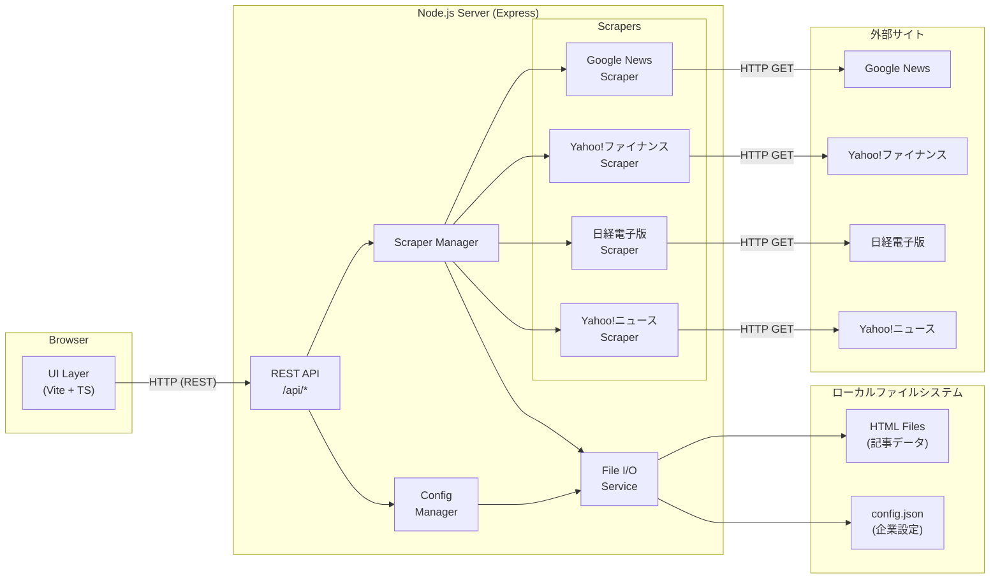
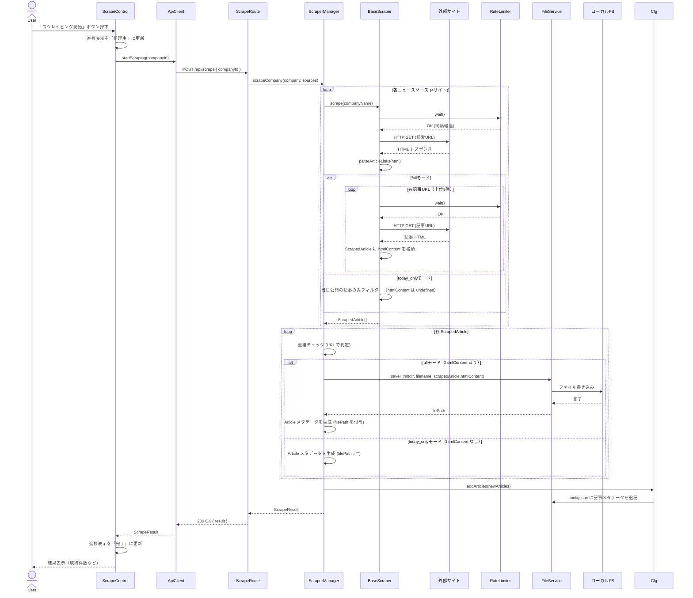
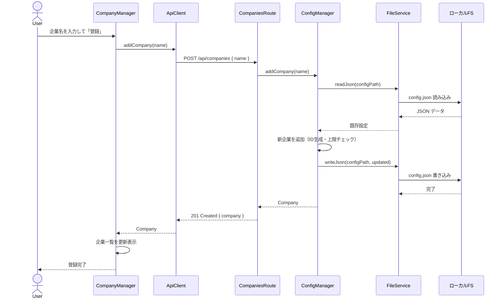
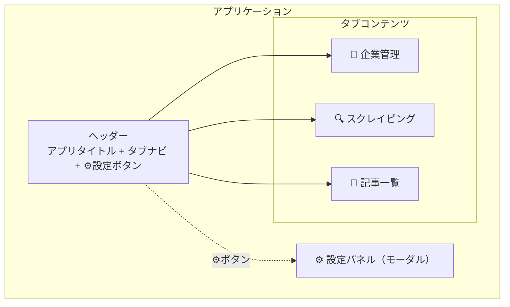

# SPEC: WEBスクレイピングツール

> **SPEC駆動開発 (SDD)** — 本ドキュメントが唯一の信頼できる仕様源です。
> 実装は必ず本SPECに準拠し、変更がある場合はSPECを先に更新してください。

---

## 1. 概要 (Overview)

### 1.1 プロジェクト概要

| 項目           | 内容                                                           |
| -------------- | -------------------------------------------------------------- |
| プロジェクト名 | Stock News Scraper                                             |
| 概要           | 企業ニュースを収集し、株価傾向分析の入力データを生成するツール |
| バージョン     | 0.1.0                                                          |
| 最終更新日     | 2026-02-28                                                     |
| ステータス     | Draft                                                          |

### 1.2 目的・背景

株価の変動要因を分析するために、過去の株価に連動したと思われるニュース記事を収集・蓄積する必要がある。本ツールは、ユーザが指定した企業に関するニュース記事をWebからスクレイピングし、株価傾向分析ツールへのインプットデータとして提供することを目的とする。

- **対象ユーザ:** 個人利用（自分専用）
- **ユースケース:** ユーザが企業名を設定 → ニュース記事を収集 → HTML形式で保存 → 株価分析ツールの入力データとして活用

### 1.3 スコープ

<!-- 本プロジェクトで対応する範囲と対応しない範囲を明確にする -->

**対応する範囲 (In Scope):**

- ユーザが企業名（銘柄）を設定・管理する機能
- 設定された企業に関するニュース記事のスクレイピング
- スクレイピング結果をHTMLファイル（記事そのもの）として保存・出力
- ユーザ操作をトリガーとしたスクレイピング実行（手動実行）
- Webアプリとしてのブラウザベースのユーザインターフェース

**対応しない範囲 (Out of Scope):**

- ログイン認証が必要なサイトのスクレイピング
- 株価分析・予測ロジック本体（本ツールはデータ収集のみ）
- 定期自動実行 / スケジューリング（将来対応の可能性あり、現時点では対象外）
- マルチユーザ対応・認証・権限管理
- モバイルアプリ対応

---

## 2. 要件定義 (Requirements)

### 2.1 機能要件 (Functional Requirements)

| ID     | 要件                                                                                                                                             | 優先度 | ステータス |
| ------ | ------------------------------------------------------------------------------------------------------------------------------------------------ | ------ | ---------- |
| FR-001 | 企業名（銘柄）の登録・編集・削除ができる（最大30社）                                                                                             | Must   | TODO       |
| FR-002 | 登録企業一覧を保存ディレクトリ内の設定ファイルに永続化する                                                                                       | Must   | TODO       |
| FR-003 | ユーザがボタン操作で選択した企業のニュース記事スクレイピングを実行できる                                                                         | Must   | TODO       |
| FR-004 | Google Newsからニュース記事を取得できる                                                                                                          | Must   | TODO       |
| FR-005 | Yahoo!ファイナンスからニュース記事を取得できる                                                                                                   | Must   | TODO       |
| FR-006 | 日経電子版からニュース記事を取得できる                                                                                                           | Must   | TODO       |
| FR-007 | Yahoo!ニュースからニュース記事を取得できる                                                                                                       | Must   | TODO       |
| FR-008 | スクレイピング結果をHTMLファイル（記事本文）としてユーザ指定ディレクトリに保存する                                                               | Must   | TODO       |
| FR-009 | ユーザが保存先ディレクトリを選択・変更できる                                                                                                     | Must   | TODO       |
| FR-010 | 収集済み記事の一覧を日付順で表示できる                                                                                                           | Must   | TODO       |
| FR-011 | 全登録企業を対象に一括スクレイピングを実行できる                                                                                                 | Should | TODO       |
| FR-012 | スクレイピングの進捗状況をUIに表示する（処理中/完了/エラー）                                                                                     | Should | TODO       |
| FR-013 | 重複記事の検出・スキップを行う                                                                                                                   | Should | TODO       |
| FR-014 | 「当日ニュースのみ」モードを選択できる。有効時は検索結果から当日公開の記事のみを収集し、記事本文HTML取得をスキップする（検索結果ページのみ保存） | Must   | TODO       |

### 2.2 非機能要件 (Non-Functional Requirements)

| ID      | 要件                                                                                                                                                             | カテゴリ               | ステータス |
| ------- | ---------------------------------------------------------------------------------------------------------------------------------------------------------------- | ---------------------- | ---------- |
| NFR-001 | 30社分のスクレイピングを妥当な時間内（目安15分以内）に完了する。サイト間は並行実行し、同一サイト内は2秒間隔を遵守する。記事本文の取得は検索結果上位5件に限定する | パフォーマンス         | TODO       |
| NFR-002 | 同一サイトへのリクエスト間隔を最低2秒確保する。異なるサイトへは並行リクエスト可（最大4並行）                                                                     | 倫理・コンプライアンス | TODO       |
| NFR-003 | 対象サイトのrobots.txtを尊重する                                                                                                                                 | 倫理・コンプライアンス | TODO       |
| NFR-004 | 直感的に操作可能なUI（マニュアル不要で利用できるレベル）                                                                                                         | ユーザビリティ         | TODO       |
| NFR-005 | 保存先ディレクトリ以外のファイルシステムにアクセスしない                                                                                                         | セキュリティ           | TODO       |
| NFR-006 | スクレイピング失敗時にアプリがクラッシュしない（エラーをハンドリングし継続）                                                                                     | 信頼性                 | TODO       |

### 2.3 制約事項

- **技術スタック:** フロントエンド: Vite + TypeScript / バックエンド: Node.js + Express + TypeScript
- **対応ブラウザ:** Chrome 最新版のみ
- **アーキテクチャ:** ブラウザからの直接スクレイピングはCORS制約があるため、Node.jsバックエンドサーバーを経由してスクレイピングを行う
- **スクレイピング対象:** Google News / Yahoo!ファイナンス / 日経電子版 / Yahoo!ニュース（公開ページのみ、ログイン不要のもの）
- **登録企業数上限:** 最大30社
- **データ保存:** ユーザが指定したローカルディレクトリにHTMLファイルとして保存（DB不使用）
- **利用形態:** 個人利用（ローカル環境で起動）
- **利用規約:** スクレイピング対象サイトの利用規約は未確認。動作確認時は「当日ニュースのみモード」（FR-014）を使用し、リクエスト数を最小限に押さえること

---

## 3. アーキテクチャ設計 (Architecture)

### 3.1 システム構成図



**通信フロー:**

1. ブラウザ (UI) → Express サーバー: REST API 呼び出し (`localhost`)
2. Express サーバー → 外部サイト: HTTP GET でページ取得（CORS 回避）
3. Express サーバー → ローカルFS: 記事 HTML 保存 / 設定ファイル読み書き

### 3.2 技術スタック

| レイヤー       | 技術                           | 備考                                              |
| -------------- | ------------------------------ | ------------------------------------------------- |
| フロントエンド | Vite + TypeScript              | SPA、UIフレームワークなし（Vanilla TS）           |
| バックエンド   | Node.js + Express + TypeScript | REST API サーバー、CORS回避のプロキシ兼務         |
| スクレイピング | axios + cheerio                | HTTP取得 + HTMLパース。JSレンダリング不要の前提   |
| データ保存     | ローカルファイルシステム (fs)  | HTML ファイル + JSON 設定ファイル。DB不使用       |
| 共有型定義     | TypeScript (shared types)      | フロント・バックエンド間で共有する型定義          |
| テスト         | Vitest                         | ユニットテスト。Vite エコシステムとの親和性が高い |
| リンター       | ESLint + Prettier              | コード品質・フォーマット統一                      |

### 3.3 ディレクトリ構成

```
/
├── package.json              # ルート（ワークスペース管理・共通スクリプト）
├── tsconfig.json             # ベース TypeScript 設定
├── SPEC.md
│
├── shared/                   # フロント・バックエンド共有コード
│   └── types/
│       ├── company.ts        # 企業データ型定義
│       ├── article.ts        # 記事データ型定義
│       └── api.ts            # API リクエスト/レスポンス型定義
│
├── client/                   # フロントエンド (Vite + TS)
│   ├── index.html
│   ├── vite.config.ts
│   ├── tsconfig.json
│   └── src/
│       ├── main.ts           # エントリーポイント
│       ├── style.css         # グローバルスタイル
│       ├── components/       # UI コンポーネント
│       │   ├── CompanyManager.ts    # 企業登録・管理 UI
│       │   ├── ScrapeControl.ts     # スクレイピング実行 UI
│       │   └── ArticleList.ts       # 記事一覧表示 UI
│       ├── services/         # API クライアント
│       │   └── apiClient.ts
│       └── utils/
│
└── server/                   # バックエンド (Express + TS)
    ├── tsconfig.json
    └── src/
        ├── index.ts          # サーバーエントリーポイント
        ├── routes/           # API ルート定義
        │   ├── companies.ts  # /api/companies
        │   ├── scrape.ts     # /api/scrape
        │   ├── articles.ts   # /api/articles
        │   └── config.ts     # /api/config
        ├── scrapers/         # サイト別スクレイパー
        │   ├── BaseScraper.ts
        │   ├── GoogleNewsScraper.ts
        │   ├── YahooFinanceScraper.ts
        │   ├── NikkeiScraper.ts
        │   └── YahooNewsScraper.ts
        ├── services/         # ビジネスロジック
        │   ├── ScraperManager.ts
        │   ├── ConfigManager.ts
        │   └── FileService.ts
        └── utils/
            └── rateLimiter.ts  # リクエスト間隔制御
```

---

## 4. コンポーネント設計 (Component Design)

### 4.1 コンポーネント一覧

**フロントエンド (client)**

| コンポーネント名 | 責務                                             | 依存先    |
| ---------------- | ------------------------------------------------ | --------- |
| CompanyManager   | 企業の登録・編集・削除 UI を提供する             | ApiClient |
| ScrapeControl    | スクレイピング実行ボタン・進捗表示 UI を提供する | ApiClient |
| ArticleList      | 収集済み記事の日付順一覧表示 UI を提供する       | ApiClient |
| ApiClient        | バックエンド REST API への HTTP 通信を抽象化する | fetch API |

**バックエンド (server)**

| コンポーネント名    | 責務                                                       | 依存先                                |
| ------------------- | ---------------------------------------------------------- | ------------------------------------- |
| CompaniesRoute      | /api/companies のルーティングとリクエスト処理              | ConfigManager                         |
| ScrapeRoute         | /api/scrape のルーティングとリクエスト処理                 | ScraperManager                        |
| ArticlesRoute       | /api/articles のルーティングとリクエスト処理               | ConfigManager                         |
| ConfigRoute         | /api/config のルーティングとリクエスト処理                 | ConfigManager                         |
| ScraperManager      | スクレイピング全体の制御（対象サイト振り分け・並行制御）   | BaseScraper, FileService, RateLimiter |
| BaseScraper         | スクレイパーの共通インターフェースと基本処理を定義（抽象） | axios, cheerio                        |
| GoogleNewsScraper   | Google News のページ構造に特化した記事抽出                 | BaseScraper                           |
| YahooFinanceScraper | Yahoo!ファイナンスのページ構造に特化した記事抽出           | BaseScraper                           |
| NikkeiScraper       | 日経電子版のページ構造に特化した記事抽出                   | BaseScraper                           |
| YahooNewsScraper    | Yahoo!ニュースのページ構造に特化した記事抽出               | BaseScraper                           |
| ConfigManager       | 企業設定（config.json）の読み書きを管理する                | FileService                           |
| FileService         | ファイルシステムへの読み書きを抽象化する                   | Node.js fs                            |
| RateLimiter         | リクエスト間隔を制御しスクレイピング先への負荷を抑制する   | なし                                  |

**共有 (shared)**

| コンポーネント名 | 責務                              | 依存先 |
| ---------------- | --------------------------------- | ------ |
| types/company    | Company 型の定義                  | なし   |
| types/article    | Article 型の定義                  | なし   |
| types/api        | API リクエスト/レスポンスの型定義 | なし   |

### 4.2 クラス図 (UML)

```mermaid
classDiagram
    direction TB

    %% === Shared Types ===
    class Company {
        +id: string
        +name: string
        +createdAt: string
    }

    class Article {
        +id: string
        +companyId: string
        +title: string
        +url: string
        +source: ScrapingSource
        +publishedAt: string
        +scrapedAt: string
        +filePath: string
    }

    class ScrapedArticle {
        +title: string
        +url: string
        +source: ScrapingSource
        +publishedAt: string
        +htmlContent: string
    }

    class ScrapingSource {
        <<enumeration>>
        google_news
        yahoo_finance
        nikkei
        yahoo_news
    }

    %% === Server: Scrapers ===
    class BaseScraper {
        <<abstract>>
        #source: ScrapingSource
        #rateLimiter: RateLimiter
        +scrape(companyName: string): Promise~ScrapedArticle[]~
        #fetchPage(url: string): Promise~string~
        #parseArticleLinks(html: string, companyName: string)*: ArticleLink[]
        #fetchArticleContent(url: string): Promise~string~
        #buildSearchUrl(companyName: string)*: string
    }

    class GoogleNewsScraper {
        #parseArticleLinks(html, companyName): ArticleLink[]
        #buildSearchUrl(companyName): string
    }
    class YahooFinanceScraper {
        #parseArticleLinks(html, companyName): ArticleLink[]
        #buildSearchUrl(companyName): string
    }
    class NikkeiScraper {
        #parseArticleLinks(html, companyName): ArticleLink[]
        #buildSearchUrl(companyName): string
    }
    class YahooNewsScraper {
        #parseArticleLinks(html, companyName): ArticleLink[]
        #buildSearchUrl(companyName): string
    }

    BaseScraper <|-- GoogleNewsScraper
    BaseScraper <|-- YahooFinanceScraper
    BaseScraper <|-- NikkeiScraper
    BaseScraper <|-- YahooNewsScraper

    %% === Server: Services ===
    class ScraperManager {
        -scrapers: BaseScraper[]
        -fileService: FileService
        -configManager: ConfigManager
        +scrapeCompany(company: Company, sources: ScrapingSource[]): Promise~ScrapeResult~
        +scrapeAll(companies: Company[]): Promise~ScrapeResult[]~
        -saveArticles(company: Company, scraped: ScrapedArticle[]): Promise~Article[]~
    }

    class ConfigManager {
        -fileService: FileService
        -configPath: string
        +getCompanies(): Promise~Company[]~
        +addCompany(name: string): Promise~Company~
        +updateCompany(id: string, name: string): Promise~Company~
        +deleteCompany(id: string): Promise~void~
        +getOutputDir(): Promise~string~
        +setOutputDir(dir: string): Promise~void~
    }

    class FileService {
        +readJson~T~(path: string): Promise~T~
        +writeJson(path: string, data: unknown): Promise~void~
        +saveHtml(dir: string, filename: string, content: string): Promise~string~
        +listHtmlFiles(dir: string): Promise~string[]~
        +ensureDir(dir: string): Promise~void~
    }

    class RateLimiter {
        -intervalMs: number
        -lastRequestTime: number
        +wait(): Promise~void~
    }

    %% === Client ===
    class ApiClient {
        -baseUrl: string
        +getCompanies(): Promise~Company[]~
        +addCompany(name: string): Promise~Company~
        +updateCompany(id: string, name: string): Promise~Company~
        +deleteCompany(id: string): Promise~void~
        +startScraping(companyId: string): Promise~ScrapeResult~
        +startScrapingAll(): Promise~ScrapeResult[]~
        +getArticles(companyId?: string): Promise~Article[]~
        +getConfig(): Promise~AppConfig~
        +setOutputDir(dir: string): Promise~void~
    }

    %% === Relationships ===
    ScraperManager --> BaseScraper : uses
    ScraperManager --> FileService : saves HTML via
    ScraperManager --> ConfigManager : saves metadata via
    ConfigManager --> FileService : uses
    BaseScraper --> RateLimiter : uses
    BaseScraper ..> ScrapedArticle : produces
    ScraperManager ..> Article : creates from ScrapedArticle
    Article --> ScrapingSource : has
    Article --> Company : belongs to
```



### 4.3 シーケンス図 (UML)

**スクレイピング実行フロー（単一企業）**



**企業管理フロー**



---

## 5. データ設計 (Data Design)

### 5.1 データモデル

#### 5.1.1 共有型定義 (shared/types/)

```typescript
/** スクレイピング対象サイト */
type ScrapingSource = "google_news" | "yahoo_finance" | "nikkei" | "yahoo_news";

/**
 * スクレイピングモード
 * - 'full':      検索結果上位5件の記事本文HTMLを取得・保存（通常モード）
 * - 'today_only': 検索結果ページのみ取得し、当日公開の記事メタデータのみ保存。
 *                記事本文HTMLは取得しない（リクエスト最小化）。
 *                利用規約未確認時の動作確認用。
 */
type ScrapeMode = "full" | "today_only";

/** 企業情報 */
interface Company {
  id: string; // UUID v4
  name: string; // 企業名（例: "トヨタ自動車"）
  createdAt: string; // ISO 8601 (例: "2026-02-28T10:30:00Z")
}

/** 収集記事（メタデータ。保存後に生成） */
interface Article {
  id: string; // UUID v4
  companyId: string; // 対応する Company.id
  title: string; // 記事タイトル
  url: string; // 記事元URL
  source: ScrapingSource; // 取得元サイト
  publishedAt: string; // 記事公開日 ISO 8601（取得できない場合はスクレイピング日）
  scrapedAt: string; // スクレイピング実行日時 ISO 8601
  filePath: string; // 保存先HTMLファイルの相対パス（today_onlyモードでは空文字列）
  missing?: boolean; // true: filePath のファイルが実在しない（outputDir 変更後の旧記事等）
}

/** スクレイパーが返す中間データ（本文HTML含む） */
interface ScrapedArticle {
  title: string; // 記事タイトル
  url: string; // 記事元URL
  source: ScrapingSource; // 取得元サイト
  publishedAt: string; // 記事公開日 ISO 8601
  htmlContent?: string; // 記事本文HTML（fullモード時のみ。today_onlyモードでは undefined）
}

/** スクレイピング実行結果 */
interface ScrapeResult {
  companyId: string;
  companyName: string;
  totalArticles: number; // 取得記事数
  newArticles: number; // 新規保存件数
  skippedDuplicates: number; // 重複スキップ数
  errors: ScrapeError[]; // サイト別エラー
}

/** サイト別エラー */
interface ScrapeError {
  source: ScrapingSource;
  message: string;
  statusCode?: number;
}

/**
 * アプリケーション設定
 * config.json はプロジェクトルートに配置（outputDir とは独立）。
 * outputDir は記事HTML の保存先ディレクトリを指す。
 */
interface AppConfig {
  outputDir: string; // 記事保存先ディレクトリの絶対パス
  scrapeMode: ScrapeMode; // スクレイピングモード (デフォルト: 'today_only')
  companies: Company[]; // 登録企業一覧
  articles: Article[]; // 収集済み記事メタデータ
}

/**
 * outputDir 変更時の移行仕様:
 * 1. 新しい outputDir のディレクトリ存在・書き込み権限を検証する
 * 2. config.json 内の outputDir 値を新パスに更新する
 * 3. 既存の articles/ ディレクトリは旧パスにそのまま残す（移動しない）
 * 4. articles[] 内の filePath は相対パスのため変更不要
 * 5. 旧パスの記事を新パスに移動したい場合はユーザが手動で行う
 * 6. 変更後の新規スクレイピングは新 outputDir に保存される
 * 注意: 旧 outputDir に保存された記事の filePath は
 *       config.json 内に残るが、実ファイルは旧ディレクトリを参照する。
 *       記事一覧APIは filePath の存在チェックを行い、
 *       ファイルが見つからない記事には missing フラグを付与する。
 */
```

#### 5.1.2 永続化ファイル構造

設定ファイル (`config.json`) はサーバー起動ディレクトリ（プロジェクトルート）に配置する。記事HTMLはユーザ指定の `outputDir` に保存する。これにより `outputDir` の変更が `config.json` 自体の移動を伴わない。

```
{projectRoot}/
├── config.json                           # AppConfig をJSONで保存（outputDir とは独立）
│
{outputDir}/                              # ユーザ指定の保存先ディレクトリ
└── articles/
    ├── {companyId}/
    │   ├── {articleId}.html              # 記事本文HTML
    │   ├── {articleId}.html
    │   └── ...
    └── {companyId}/
        └── ...
```

**config.json の例:**

```json
{
  "outputDir": "/home/user/scraping-data",
  "companies": [
    {
      "id": "550e8400-...",
      "name": "トヨタ自動車",
      "createdAt": "2026-02-28T10:00:00Z"
    },
    {
      "id": "6ba7b810-...",
      "name": "ソニーグループ",
      "createdAt": "2026-02-28T10:05:00Z"
    }
  ],
  "articles": [
    {
      "id": "7c9e6679-...",
      "companyId": "550e8400-...",
      "title": "トヨタ、EV新型車を発表",
      "url": "https://news.google.com/...",
      "source": "google_news",
      "publishedAt": "2026-02-27T09:00:00Z",
      "scrapedAt": "2026-02-28T10:30:00Z",
      "filePath": "articles/550e8400-.../7c9e6679-....html"
    }
  ]
}
```

#### 5.1.3 HTML ファイル命名規則

| 項目         | 規則                                                               |
| ------------ | ------------------------------------------------------------------ |
| ファイル名   | `{articleId}.html`                                                 |
| ディレクトリ | `{outputDir}/articles/{companyId}/`                                |
| フルパス例   | `/home/user/scraping-data/articles/550e8400-.../7c9e6679-....html` |
| ファイル内容 | スクレイピングした記事のHTML（元ページのまま）                     |

### 5.2 状態管理

#### クライアント側 (UI)

Vanilla TS のため、フレームワークの状態管理は使用しない。各コンポーネントが自身の状態を保持し、API レスポンスに応じて DOM を直接更新する。

| 状態           | 型                                       | 初期値                   | 管理元コンポーネント |
| -------------- | ---------------------------------------- | ------------------------ | -------------------- |
| companies      | Company[]                                | []                       | CompanyManager       |
| articles       | Article[]                                | []                       | ArticleList          |
| scrapeStatus   | 'idle' \| 'running' \| 'done' \| 'error' | 'idle'                   | ScrapeControl        |
| scrapeProgress | { current: number, total: number }       | { current: 0, total: 0 } | ScrapeControl        |
| outputDir      | string                                   | ''                       | main.ts (グローバル) |

#### サーバー側

サーバーはステートレス。すべての永続データは `config.json` で管理し、リクエストごとにファイルから読み込む。

| データ           | 保存先                                   | 読み込みタイミング           |
| ---------------- | ---------------------------------------- | ---------------------------- |
| 企業一覧         | {projectRoot}/config.json の companies   | API リクエスト時             |
| 記事メタデータ   | {projectRoot}/config.json の articles    | API リクエスト時             |
| 出力ディレクトリ | {projectRoot}/config.json の outputDir   | サーバー起動時 + API時       |
| 記事HTML         | {outputDir}/articles/{companyId}/\*.html | 参照不要（ファイル保存のみ） |

---

## 6. API / インターフェース設計 (Interface Design)

### 6.1 REST API エンドポイント

バックエンドサーバーは `http://localhost:3000` で起動し、以下の REST API を提供する。

#### 企業管理 API

| メソッド | エンドポイント     | 説明         | リクエスト       | レスポンス           |
| -------- | ------------------ | ------------ | ---------------- | -------------------- |
| GET      | /api/companies     | 企業一覧取得 | —                | Company[]            |
| POST     | /api/companies     | 企業登録     | { name: string } | Company              |
| PUT      | /api/companies/:id | 企業名更新   | { name: string } | Company              |
| DELETE   | /api/companies/:id | 企業削除     | —                | { success: boolean } |

#### スクレイピング API

| メソッド | エンドポイント  | 説明                     | リクエスト                               | レスポンス     |
| -------- | --------------- | ------------------------ | ---------------------------------------- | -------------- |
| POST     | /api/scrape     | 単一企業スクレイピング   | { companyId: string, mode?: ScrapeMode } | ScrapeResult   |
| POST     | /api/scrape/all | 全企業一括スクレイピング | { mode?: ScrapeMode }                    | ScrapeResult[] |

> `mode` 省略時は config.json の `scrapeMode` 設定値を使用（デフォルト: `today_only`）

#### 記事 API

| メソッド | エンドポイント | 説明                   | リクエスト            | レスポンス |
| -------- | -------------- | ---------------------- | --------------------- | ---------- |
| GET      | /api/articles  | 記事一覧取得（全企業） | ?companyId=xxx (任意) | Article[]  |

#### 設定 API

| メソッド | エンドポイント         | 説明                   | リクエスト            | レスポンス            |
| -------- | ---------------------- | ---------------------- | --------------------- | --------------------- |
| GET      | /api/config            | 現在の設定を取得       | —                     | { outputDir: string } |
| PUT      | /api/config/output-dir | 保存先ディレクトリ変更 | { outputDir: string } | { outputDir: string } |

---

#### 詳細仕様

**POST /api/companies — 企業登録**

```
Request:
  Content-Type: application/json
  Body: { "name": "トヨタ自動車" }

Response (201 Created):
  {
    "id": "550e8400-...",
    "name": "トヨタ自動車",
    "createdAt": "2026-02-28T10:00:00Z"
  }

Error (400 Bad Request): 名前が空
  { "error": "Company name is required" }

Error (409 Conflict): 登録上限（30社）超過
  { "error": "Maximum number of companies (30) reached" }
```

**POST /api/scrape — 単一企業スクレイピング**

```
Request:
  Content-Type: application/json
  Body: { "companyId": "550e8400-..." }

Response (200 OK):
  {
    "companyId": "550e8400-...",
    "companyName": "トヨタ自動車",
    "totalArticles": 12,
    "newArticles": 8,
    "skippedDuplicates": 4,
    "errors": [
      { "source": "nikkei", "message": "Request timeout", "statusCode": 408 }
    ]
  }

Error (404 Not Found): 企業が存在しない
  { "error": "Company not found" }
```

**GET /api/articles — 記事一覧取得**

```
Request:
  GET /api/articles?companyId=550e8400-...
  （companyId 省略時は全企業の記事を返却）

Response (200 OK):
  [
    {
      "id": "7c9e6679-...",
      "companyId": "550e8400-...",
      "title": "トヨタ、EV新型車を発表",
      "url": "https://news.google.com/...",
      "source": "google_news",
      "publishedAt": "2026-02-27T09:00:00Z",
      "scrapedAt": "2026-02-28T10:30:00Z",
      "filePath": "articles/550e8400-.../7c9e6679-....html",
      "missing": false
    }
  ]
  ※ publishedAt の降順（新しい記事が先頭）
  ※ missing: filePath のファイルが存在しない場合 true（outputDir 変更後等）
  ※ filePath が空文字列の記事（today_only モード取得分）は missing を付与しない
  ※ missing: filePath のファイルが存在しない場合 true（outputDir 変更後等）
  ※ filePath が空文字列の記事（today_only モード取得分）は missing を付与しない
```

**GET /api/config — 現在の設定を取得**

```
Request:
  GET /api/config

Response (200 OK):
  {
    "outputDir": "/home/user/stock-news",
    "scrapeMode": "today_only"
  }
```

**PUT /api/config/output-dir — 保存先ディレクトリ変更**

```
Request:
  Content-Type: application/json
  Body: { "outputDir": "/home/user/new-output" }

Response (200 OK):
  {
    "outputDir": "/home/user/new-output"
  }
  ※ 既存の articles/ は旧ディレクトリに残る（自動移動しない）
  ※ 旧パスの記事は missing: true として記事一覧APIに反映される

Error (400 Bad Request): パスが空
  { "error": "outputDir is required" }

Error (400 Bad Request): パスが相対パス
  { "error": "outputDir must be an absolute path" }

Error (404 Not Found): 指定ディレクトリが存在しない
  { "error": "Directory does not exist: /home/user/nonexistent" }

Error (403 Forbidden): 書き込み権限がない
  { "error": "No write permission for directory: /home/user/readonly" }
```

**PUT /api/config/scrape-mode — スクレイピングモード変更**

```
Request:
  Content-Type: application/json
  Body: { "mode": "full" }

Response (200 OK):
  {
    "scrapeMode": "full"
  }

Error (400 Bad Request): 不正なモード値
  { "error": "Invalid mode. Allowed values: full, today_only" }
```

### 6.2 サーバー内部インターフェース

サーバー内のモジュール間インターフェースを以下に定義する。

```typescript
/** スクレイパー基底インターフェース */
interface IScraper {
  readonly source: ScrapingSource;
  scrape(companyName: string): Promise<ScrapedArticle[]>;
}

/** スクレイパー管理 */
interface IScraperManager {
  scrapeCompany(
    company: Company,
    sources?: ScrapingSource[],
  ): Promise<ScrapeResult>;
  scrapeAll(companies: Company[]): Promise<ScrapeResult[]>;
}

/** 設定管理 */
interface IConfigManager {
  getConfig(): Promise<AppConfig>;
  getCompanies(): Promise<Company[]>;
  addCompany(name: string): Promise<Company>;
  updateCompany(id: string, name: string): Promise<Company>;
  deleteCompany(id: string): Promise<void>;
  getOutputDir(): Promise<string>;
  setOutputDir(dir: string): Promise<void>;
  addArticles(articles: Article[]): Promise<void>;
  getArticles(companyId?: string): Promise<Article[]>;
}

/** ファイル操作 */
interface IFileService {
  readJson<T>(path: string): Promise<T>;
  writeJson(path: string, data: unknown): Promise<void>;
  saveHtml(dir: string, filename: string, content: string): Promise<string>;
  listHtmlFiles(dir: string): Promise<string[]>;
  ensureDir(dir: string): Promise<void>;
  exists(path: string): Promise<boolean>;
}

/** リクエスト間隔制御 */
interface IRateLimiter {
  wait(): Promise<void>;
}
```

### 6.3 外部サイト通信仕様

各スクレイパーが外部サイトへアクセスする際の仕様。

| 対象               | メソッド | URL パターン例                                       | レスポンス形式 | 備考                   |
| ------------------ | -------- | ---------------------------------------------------- | -------------- | ---------------------- |
| Google News        | GET      | `https://news.google.com/search?q={企業名}&hl=ja`    | HTML           | 検索結果ページをパース |
| Yahoo!ファイナンス | GET      | `https://finance.yahoo.co.jp/search/?query={企業名}` | HTML           | ニュースタブをパース   |
| 日経電子版         | GET      | `https://www.nikkei.com/search?keyword={企業名}`     | HTML           | 公開記事のみ取得       |
| Yahoo!ニュース     | GET      | `https://news.yahoo.co.jp/search?p={企業名}`         | HTML           | 検索結果ページをパース |

**共通ルール:**

- User-Agent: アプリ名とバージョンを含めた文字列を設定する (`StockNewsScraper/0.1.0`)
- リクエスト間隔: 同一サイトへは最低 **2秒** の間隔を設ける (NFR-002)
- サイト間並行: 異なるサイトへは **最大4並行** でリクエスト可能 (NFR-001)
- タイムアウト: 1リクエストあたり **10秒** でタイムアウト
- リトライ: タイムアウト時は **1回** リトライ（3秒待機後）
- robots.txt: 初回アクセス時に確認し、Disallow パスには従う (NFR-003)

**モード別動作:**

| 項目                 | `full` モード                     | `today_only` モード                   |
| -------------------- | --------------------------------- | ------------------------------------- |
| 検索結果ページ取得   | ✅ 取得                           | ✅ 取得                               |
| 記事本文HTML取得     | ✅ 上位5件                        | ❌ スキップ（リクエスト最小化）       |
| 対象記事のフィルター | なし（上位5件すべて）             | 当日公開の記事のみ                    |
| 保存内容             | 記事本文HTMLファイル              | メタデータのみ（filePath は空文字列） |
| リクエスト数/企業    | 検索ページ4回 + 記事本斒20回 = 24 | 検索ページ4回のみ = 4                 |
| 用途                 | 本番運用（利用規約確認後）        | 動作確認・利用規約未確認時            |

**パフォーマンス見積もり (NFR-001):**

```
1企業あたり:
  検索ページ取得: 4サイト並行 × 1リクエスト = ~2秒 (並行実行)
  記事本文取得:   4サイト並行 × 5件 × 2秒間隔 = ~10秒 (サイト内直列)
  合計: ~12秒/企業

30企業: 30 × 12秒 = ~360秒 (6分)
※ サイト間並行により実測は ~10〜15分を想定
```

---

## 7. UI / 画面設計 (UI Design)

### 7.1 画面一覧

本アプリはシングルページアプリケーション (SPA) とし、画面遷移は行わず、1画面内のタブ切り替えで構成する。

| タブID  | タブ名         | 概要                                       | 対応要件               |
| ------- | -------------- | ------------------------------------------ | ---------------------- |
| TAB-001 | 企業管理       | 企業の登録・編集・削除を行う               | FR-001, FR-002         |
| TAB-002 | スクレイピング | 対象企業を選択してスクレイピングを実行する | FR-003, FR-011, FR-012 |
| TAB-003 | 記事一覧       | 収集済み記事を日付順で確認する             | FR-010                 |
| —       | ヘッダー       | アプリタイトル・タブナビゲーション         | —                      |
| —       | 設定パネル     | 保存先ディレクトリの表示・変更             | FR-009                 |

### 7.2 画面構成図



### 7.3 ワイヤーフレーム

#### TAB-001: 企業管理タブ

```
┌────────────────────────────────────────────────────────────┐
│  Stock News Scraper           [企業管理] [スクレイピング] [記事一覧]  ⚙  │
├────────────────────────────────────────────────────────────┤
│                                                            │
│  企業名登録                                                  │
│  ┌──────────────────────────────────────┐  ┌──────────┐      │
│  │  企業名を入力...                        │  │  登録    │      │
│  └──────────────────────────────────────┘  └──────────┘      │
│                                               (3 / 30社)   │
│  登録企業一覧                                                  │
│  ┌────────────────────────────────────────────────────┐      │
│  │  1. トヨタ自動車             2026-02-28   [編集] [削除]  │      │
│  │  2. ソニーグループ           2026-02-28   [編集] [削除]  │      │
│  │  3. 任天堂                   2026-02-28   [編集] [削除]  │      │
│  └────────────────────────────────────────────────────┘      │
│                                                            │
└────────────────────────────────────────────────────────────┘
```

**操作説明:**

- テキスト入力欄に企業名を入力し「登録」ボタンで追加
- 登録済み企業はリスト表示、各行に「編集」「削除」ボタン
- 「編集」押下で企業名がインライン編集可能になる
- 「削除」押下で確認ダイアログ表示後に削除
- 現在の登録数 / 上限数 を表示

#### TAB-002: スクレイピングタブ

```
┌────────────────────────────────────────────────────────────┐
│  Stock News Scraper           [企業管理] [スクレイピング] [記事一覧]  ⚙  │
├────────────────────────────────────────────────────────────┤
│                                                            │
│  対象企業選択                                                  │
│  ┌──────────────────────────────────────┐                    │
│  │  ☐ トヨタ自動車                          │                    │
│  │  ☑ ソニーグループ                        │                    │
│  │  ☑ 任天堂                              │                    │
│  └──────────────────────────────────────┘                    │
│                                                            │
│  モード: (◉) 当日ニュースのみ   ( ) フル取得                    │
│         ⚠ 利用規約未確認のため「当日ニュースのみ」推奨           │
│                                                            │
│  ┌──────────────────┐  ┌──────────────────────┐              │
│  │  選択企業を取得    │  │  全企業を一括取得      │              │
│  └──────────────────┘  └──────────────────────┘              │
│                                                            │
│  進捗状況                                                    │
│  ┌────────────────────────────────────────────────────┐      │
│  │  ソニーグループ  ████████████████████▓▓▓▓▓  3/4 サイト  │      │
│  │  任天堂          ░░░░░░░░░░░░░░░░░░░░░░░░░  待機中       │      │
│  └────────────────────────────────────────────────────┘      │
│                                                            │
│  実行結果                                                    │
│  ┌────────────────────────────────────────────────────┐      │
│  │  ✅ ソニーグループ:  12件取得 (8 新規 / 4 スキップ)     │      │
│  │  ⚠️ ソニーグループ:  日経電子版 - タイムアウト         │      │
│  │  ⏳ 任天堂:          処理中...                           │      │
│  └────────────────────────────────────────────────────┘      │
│                                                            │
└────────────────────────────────────────────────────────────┘
```

**操作説明:**

- チェックボックスでスクレイピング対象企業を選択
- 「選択企業を取得」で選択した企業のみ実行、「全企業を一括取得」で全社実行
- 処理中は企業ごとのプログレスバーとサイト処理状況を表示
- 完了後、企業ごとに取得件数・スキップ数・エラーを表示
- スクレイピング実行中はボタンを無効化（多重実行防止）

#### TAB-003: 記事一覧タブ

```
┌────────────────────────────────────────────────────────────┐
│  Stock News Scraper           [企業管理] [スクレイピング] [記事一覧]  ⚙  │
├────────────────────────────────────────────────────────────┤
│                                                            │
│  企業フィルター: [全企業        ▼]                          │
│                                                            │
│  ┌────────────────────────────────────────────────────┐      │
│  │  日付         タイトル            ソース    企業     │      │
│  ├────────────────────────────────────────────────────┤      │
│  │  2026-02-28  トヨタ、EV新型車を..  Google   トヨタ   │      │
│  │  2026-02-28  ソニーPS6好調で..   Yahoo!F  ソニー   │      │
│  │  2026-02-27  任天堂新作発表..    日経     任天堂   │      │
│  │  2026-02-27  トヨタ収益上方修.. Yahoo!N  トヨタ   │      │
│  │  ...                                                │      │
│  └────────────────────────────────────────────────────┘      │
│                                           合計: 48件       │
│                                                            │
└────────────────────────────────────────────────────────────┘
```

**操作説明:**

- ドロップダウンで企業をフィルター（「全企業」または特定企業）
- 記事は `publishedAt` の降順（新しい順）でテーブル表示
- 各行に日付・タイトル・ソース・企業名を表示
- 合計件数をテーブル下部に表示

#### 設定パネル（モーダル）

```
┌──────────────────────────────────────┐
│  ⚙ 設定                              ×  │
├──────────────────────────────────────┤
│                                      │
│  保存先ディレクトリ                      │
│  ┌──────────────────────────┐  ┌───┐  │
│  │  /home/user/scraping-data  │  │ 参照│  │
│  └──────────────────────────┘  └───┘  │
│                                      │
│  スクレイピングモード                    │
│  (◉) 当日ニュースのみ (推奨)            │
│  ( ) フル取得                            │
│  ⚠ 利用規約未確認のため               │
│    「当日ニュースのみ」を推奨します  │
│                                      │
│              ┌────────────┐          │
│              │   保存     │          │
│              └────────────┘          │
│                                      │
└──────────────────────────────────────┘
```

**操作説明:**

- ヘッダーの⚙ボタンでモーダルを開閉
- 現在の保存先パスを表示
- 「参照」ボタンでテキスト入力によるパス指定（バックエンド側でディレクトリ存在確認）
- 「保存」ボタンで設定を反映

---

## 8. エラー設計 (Error Handling)

### 8.1 エラー分類

#### スクレイピングエラー

| エラーコード | 種別               | メッセージ例                                            | 対処方針                                                         |
| ------------ | ------------------ | ------------------------------------------------------- | ---------------------------------------------------------------- |
| E-S001       | HTTP エラー        | `{source}: HTTP {statusCode} エラー`                    | ステータスコードをログに記録し、該当サイトをスキップして次へ進む |
| E-S002       | タイムアウト       | `{source}: リクエストがタイムアウトしました`            | 3秒待機後に1回リトライ。再度失敗ならスキップ                     |
| E-S003       | パースエラー       | `{source}: ページ構造の解析に失敗しました`              | ログ記録してスキップ。サイト側の構造変更の可能性をUIに警告       |
| E-S004       | robots.txt 拒否    | `{source}: robots.txt によりアクセスが制限されています` | 該当サイトのスクレイピングを中止                                 |
| E-S005       | アクセス拒否 (403) | `{source}: アクセスが拒否されました`                    | リトライせずスキップ。レート制限の可能性をログに記録             |

#### ファイルシステムエラー

| エラーコード | 種別             | メッセージ例                                       | 対処方針                                               |
| ------------ | ---------------- | -------------------------------------------------- | ------------------------------------------------------ |
| E-F001       | ディレクトリ不在 | `保存先ディレクトリが存在しません: {path}`         | UIにエラー表示。設定パネルでパス変更を促す             |
| E-F002       | 書き込み権限なし | `ディレクトリへの書き込み権限がありません: {path}` | UIにエラー表示。パス変更または権限修正を促す           |
| E-F003       | ディスク容量不足 | `ディスク容量が不足しています`                     | UIにエラー表示。処理を中断                             |
| E-F004       | config.json 破損 | `設定ファイルの読み込みに失敗しました`             | バックアップから復元を試行。不可なら初期状態にリセット |

#### API エラー（クライアント↔サーバー間）

| エラーコード | HTTP ステータス | メッセージ例                           | 対処方針                                     |
| ------------ | --------------- | -------------------------------------- | -------------------------------------------- |
| E-A001       | 400             | `企業名を入力してください`             | UIにバリデーションエラーを表示               |
| E-A002       | 404             | `指定された企業が見つかりません`       | UIにエラー表示。企業一覧を再取得             |
| E-A003       | 409             | `企業の登録上限（30社）に達しています` | UIにエラー表示。不要な企業の削除を促す       |
| E-A004       | 409             | `同じ企業名が既に登録されています`     | UIにエラー表示                               |
| E-A005       | 500             | `サーバー内部エラーが発生しました`     | UIにエラー表示。リトライを促す               |
| E-A006       | 0 (接続不可)    | `サーバーに接続できません`             | UIにエラー表示。サーバー起動状態の確認を促す |

### 8.2 エラーハンドリング方針

#### 基本原則

1. **アプリケーションを停止させない** — いかなるエラーもアプリのクラッシュにつなげない (NFR-006)
2. **部分的成功を許容する** — 4サイト中1サイトが失敗しても、残り3サイトの結果は正常に保存する
3. **ユーザに適切にフィードバックする** — エラーの内容と対処方法をUIに表示する
4. **ログを残す** — すべてのエラーをサーバーのコンソールに記録する（デバッグ用）

#### レイヤー別ハンドリング

**サーバー側:**

```
スクレイパー層:
  - try/catch で各サイトごとにエラーを捕捉
  - エラーを ScrapeError 型に変換して ScrapeResult.errors に格納
  - 次のサイトの処理を継続

サービス層:
  - ファイルI/Oエラーを捕捉してログ + 適切なHTTPエラーに変換
  - config.json 読み込み失敗時はデフォルト設定でフォールバック

ルート層:
  - Express のエラーハンドリングミドルウェアで未捕捉エラーを一括処理
  - 統一されたエラーレスポンス形式: { error: string, code?: string }
```

**クライアント側:**

```
ApiClient:
  - すべてのAPIコールを try/catch でラップ
  - ネットワークエラー (fetch 失敗) を検出してユーザフレンドリーなメッセージに変換
  - HTTPエラーレスポンスのボディからエラーメッセージを抽出

UIコンポーネント:
  - エラー時は該当箇所にインラインでエラーメッセージを表示（赤文字）
  - 3秒後に自動で消える通知型エラー（トースト）は使用しない（見逃し防止）
  - スクレイピング結果の部分エラーは結果エリアに警告アイコン付きで表示
```

#### config.json の保護

| シナリオ             | 対処                                                             |
| -------------------- | ---------------------------------------------------------------- |
| ファイルが存在しない | デフォルト設定（空の企業リスト）で新規作成                       |
| JSON パースエラー    | `.bak` ファイルから復元を試行。不可なら初期化                    |
| 書き込み中断         | 一時ファイルに書き込み後、リネームで上書き（アトミック書き込み） |

## 9. テスト計画 (Test Plan)

### 9.1 テスト方針

| テスト種別     | 対象                                         | ツール | 基準                                    |
| -------------- | -------------------------------------------- | ------ | --------------------------------------- |
| ユニットテスト | サーバー側: Service, Scraper, Utils          | Vitest | カバレッジ 80% 以上（スクレイパー除く） |
| 結合テスト     | サーバー側: API Route ↔ Service ↔ FileSystem | Vitest | 全APIエンドポイントの正常/エラー系      |

> **E2Eテストはスコープ外** — 個人利用ツールのため、ユニット・結合テストで十分な品質を担保する。

#### テスト戦略

- **スクレイパーのテスト:** 外部サイトへの実際のリクエストは行わない。HTMLフィクスチャ（サンプルHTMLファイル）を使って `parseArticles()` のパース処理をテストする
- **FileService のテスト:** 一時ディレクトリを作成して実際のFS操作をテストする（テスト後クリーンアップ）
- **APIルートのテスト:** supertest でExpressアプリに対してHTTPリクエストを発行
- **モック:** 外部HTTPリクエスト (axios) はモックする

### 9.2 テストケース

#### 企業管理

| ID     | テスト内容                    | 対応要件 | 期待結果                                                 | ステータス |
| ------ | ----------------------------- | -------- | -------------------------------------------------------- | ---------- |
| TC-001 | 企業を登録できる              | FR-001   | Company オブジェクトが返却され、config.json に保存される | TODO       |
| TC-002 | 企業名を編集できる            | FR-001   | 更新後の名前が config.json に反映される                  | TODO       |
| TC-003 | 企業を削除できる              | FR-001   | config.json から削除される                               | TODO       |
| TC-004 | 企業名が空の場合に400エラー   | FR-001   | 400 Bad Request + エラーメッセージ                       | TODO       |
| TC-005 | 30社登録済みの場合に409エラー | FR-001   | 409 Conflict + 上限エラーメッセージ                      | TODO       |
| TC-006 | 同名企業の登録時に409エラー   | FR-001   | 409 Conflict + 重複エラーメッセージ                      | TODO       |
| TC-007 | 企業一覧を取得できる          | FR-002   | Company[] が config.json の内容と一致する                | TODO       |

#### スクレイピング

| ID     | テスト内容                                   | 対応要件 | 期待結果                                               | ステータス |
| ------ | -------------------------------------------- | -------- | ------------------------------------------------------ | ---------- |
| TC-010 | Google News のHTMLを正しくパースできる       | FR-004   | タイトル・URL・日付が抽出された Article[] が返る       | TODO       |
| TC-011 | Yahoo!ファイナンスのHTMLを正しくパースできる | FR-005   | 同上                                                   | TODO       |
| TC-012 | 日経電子版のHTMLを正しくパースできる         | FR-006   | 同上                                                   | TODO       |
| TC-013 | Yahoo!ニュースのHTMLを正しくパースできる     | FR-007   | 同上                                                   | TODO       |
| TC-014 | タイムアウト時に1回リトライされる            | NFR-002  | タイムアウト後3秒待機して再試行される                  | TODO       |
| TC-015 | リクエスト間隔が2秒以上確保される            | NFR-002  | 連続リクエスト間の時間差が≥ 2000ms                     | TODO       |
| TC-016 | 1サイト失敗でも他サイトの結果が保存される    | NFR-006  | ScrapeResult.errors に失敗サイトが記録され、他は正常   | TODO       |
| TC-017 | 重複記事がスキップされる                     | FR-013   | skippedDuplicates > 0、同一URLのHTMLが二重保存されない | TODO       |

#### ファイル操作

| ID     | テスト内容                                 | 対応要件 | 期待結果                                                   | ステータス |
| ------ | ------------------------------------------ | -------- | ---------------------------------------------------------- | ---------- |
| TC-020 | HTMLファイルが正しいパスに保存される       | FR-008   | `{outputDir}/articles/{companyId}/{articleId}.html` に存在 | TODO       |
| TC-021 | 存在しないディレクトリが自動作成される     | FR-008   | ensureDir によりディレクトリが再帰的に作成される           | TODO       |
| TC-022 | config.json のアトミック書き込みが機能する | —        | 一時ファイル経由で書き込み、リネームで上書きされる         | TODO       |
| TC-023 | config.json 破損時にデフォルトで復元される | —        | 空の企業リストで初期化され、アプリが正常に動作する         | TODO       |
| TC-024 | 保存先ディレクトリを変更できる             | FR-009   | config.json の outputDir が更新される                      | TODO       |

#### 記事一覧

| ID     | テスト内容                             | 対応要件 | 期待結果                                    | ステータス |
| ------ | -------------------------------------- | -------- | ------------------------------------------- | ---------- |
| TC-030 | 全企業の記事を日付降順で取得できる     | FR-010   | publishedAt が降順に並んだ Article[] が返る | TODO       |
| TC-031 | 企業IDでフィルターした記事を取得できる | FR-010   | 指定 companyId の記事のみが返る             | TODO       |
| TC-032 | 記事が0件の場合に空配列が返る          | FR-010   | 空配列 [] が返却される                      | TODO       |

---

## 10. 開発計画 (Development Plan)

### 10.1 マイルストーン

| フェーズ | 内容                                  | 主な成果物                                                              | 対応要件                    | ステータス |
| -------- | ------------------------------------- | ----------------------------------------------------------------------- | --------------------------- | ---------- |
| Phase 0  | プロジェクト基盤構築                  | モノレポ構成、tsconfig、Vite/Express 設定、lint/format                  | —                           | TODO       |
| Phase 1  | バックエンド: 企業管理 + ファイル基盤 | ConfigManager, FileService, /api/companies, /api/config                 | FR-001, FR-002, FR-009      | TODO       |
| Phase 2  | バックエンド: スクレイピングエンジン  | BaseScraper, 4サイト別Scraper, ScraperManager, RateLimiter, /api/scrape | FR-003〜008, FR-011, FR-013 | TODO       |
| Phase 3  | フロントエンド: UI 全タブ             | CompanyManager, ScrapeControl, ArticleList, ApiClient                   | FR-010, FR-012, NFR-004     | TODO       |
| Phase 4  | 結合・テスト・安定化                  | テスト実装、エラー設計の反映、バグ修正                                  | NFR-001〜006                | TODO       |

#### Phase 0: プロジェクト基盤構築

| #   | タスク                                     | コミット例                         |
| --- | ------------------------------------------ | ---------------------------------- |
| 1   | モノレポ構成作成 (client/ server/ shared/) | `chore: モノレポ構成を作成`        |
| 2   | 共有型定義 (shared/types/)                 | `feat: 共有型定義を追加`           |
| 3   | サーバー側 Express + TypeScript 初期構成   | `chore: Express サーバー初期構成`  |
| 4   | クライアント側 Vite + TypeScript 初期構成  | `chore: Vite クライアント初期構成` |
| 5   | ESLint + Prettier 設定                     | `chore: lint/format 設定を追加`    |
| 6   | Vitest 設定                                | `chore: Vitest テスト基盤を構築`   |

#### Phase 1: バックエンド — 企業管理 + ファイル基盤

| #   | タスク                             | コミット例                  |
| --- | ---------------------------------- | --------------------------- |
| 1   | FileService 実装 + テスト          | `feat: FileService 実装`    |
| 2   | ConfigManager 実装 + テスト        | `feat: ConfigManager 実装`  |
| 3   | /api/companies ルート実装 + テスト | `feat: 企業管理 API を実装` |
| 4   | /api/config ルート実装 + テスト    | `feat: 設定 API を実装`     |

#### Phase 2: バックエンド — スクレイピングエンジン

| #   | タスク                                         | コミット例                                    |
| --- | ---------------------------------------------- | --------------------------------------------- |
| 1   | RateLimiter 実装 + テスト                      | `feat: RateLimiter 実装`                      |
| 2   | BaseScraper 抽象クラス実装                     | `feat: BaseScraper 抽象クラスを実装`          |
| 3   | GoogleNewsScraper 実装 + テスト                | `feat: Google News スクレイパーを実装`        |
| 4   | YahooFinanceScraper 実装 + テスト              | `feat: Yahoo!ファイナンス スクレイパーを実装` |
| 5   | NikkeiScraper 実装 + テスト                    | `feat: 日経電子版 スクレイパーを実装`         |
| 6   | YahooNewsScraper 実装 + テスト                 | `feat: Yahoo!ニュース スクレイパーを実装`     |
| 7   | ScraperManager 実装 + テスト                   | `feat: ScraperManager 実装`                   |
| 8   | /api/scrape, /api/articles ルート実装 + テスト | `feat: スクレイピング・記事 API を実装`       |

#### Phase 3: フロントエンド — UI

| #   | タスク                                  | コミット例                               |
| --- | --------------------------------------- | ---------------------------------------- |
| 1   | ApiClient 実装                          | `feat: ApiClient 実装`                   |
| 2   | ヘッダー + タブナビゲーション           | `feat: ヘッダー・タブ切り替え UI を実装` |
| 3   | CompanyManager（企業管理タブ）実装      | `feat: 企業管理タブ UI を実装`           |
| 4   | ScrapeControl（スクレイピングタブ）実装 | `feat: スクレイピングタブ UI を実装`     |
| 5   | ArticleList（記事一覧タブ）実装         | `feat: 記事一覧タブ UI を実装`           |
| 6   | 設定パネル（モーダル）実装              | `feat: 設定パネル UI を実装`             |
| 7   | スタイル調整                            | `feat: グローバルスタイルを適用`         |

#### Phase 4: 結合・テスト・安定化

| #   | タスク                                | コミット例                               |
| --- | ------------------------------------- | ---------------------------------------- |
| 1   | フロントエンド ↔ バックエンド結合確認 | `test: フロント・バックエンド結合テスト` |
| 2   | エラーハンドリングの網羅確認・修正    | `fix: エラーハンドリング修正`            |
| 3   | パフォーマンス確認（30社一括）        | `test: 30社一括スクレイピング性能確認`   |
| 4   | README 作成（起動方法・使い方）       | `docs: README を作成`                    |

### 10.2 コミット規約

<!-- レビューしやすいコミット粒度を維持する -->

| プレフィックス | 用途             | 例                                  |
| -------------- | ---------------- | ----------------------------------- |
| `feat:`        | 新機能追加       | feat: スクレイピングエンジン実装    |
| `fix:`         | バグ修正         | fix: パース処理のエラーハンドリング |
| `refactor:`    | リファクタリング | refactor: Service層の責務分離       |
| `docs:`        | ドキュメント更新 | docs: SPEC更新 - API設計追記        |
| `test:`        | テスト追加・修正 | test: ユニットテスト追加            |
| `chore:`       | 雑務             | chore: 依存パッケージ更新           |

---

## 11. レビューチェックリスト (Review Checklist)

> AI が実装、人間がレビューするフローで使用

- [ ] SPECに準拠した実装になっているか
- [ ] 型安全性が確保されているか
- [ ] エラーハンドリングが適切か
- [ ] テストが十分に書かれているか
- [ ] コミット粒度は適切か（レビューしやすいか）
- [ ] 不要なコード・コメントが残っていないか
- [ ] パフォーマンス上の問題がないか

---

## 変更履歴 (Changelog)

| 日付       | バージョン | 変更内容                                                                                     | 変更者 |
| ---------- | ---------- | -------------------------------------------------------------------------------------------- | ------ |
| 2026-02-28 | 0.1.0      | レビュー指摘反映②: Article型にmissingフラグ追加・シーケンス図モード分岐・設定API詳細仕様追加 | —      |
| 2026-02-28 | 0.1.0      | FR-014「当日ニュースのみモード」追加、ScrapeMode型・API・UI・通信仕様を反映                  | —      |
| 2026-02-28 | 0.1.0      | レビュー指摘反映: ScrapedArticle導入・ScrapingSource統一・config.json配置修正・NFR-001見直し | —      |
| 2026-02-28 | 0.1.0      | 初版作成（全セクション記載）                                                                 | —      |
